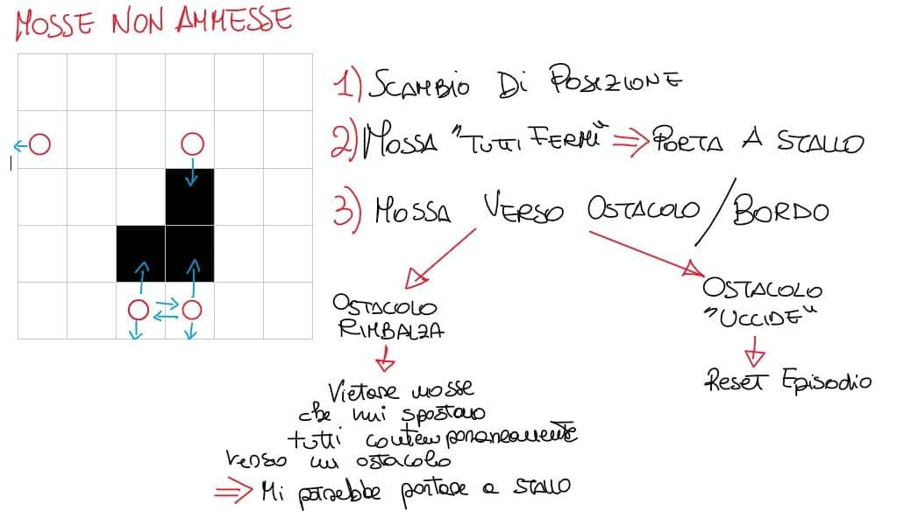

# NOTE GENERALI

Il problema è episodico, a singolo agente. L'obiettivo è spostare *n* persone entro una mappa gridworld da una posizione iniziale casuale ad una finale prefissata.
Il reward finale è complessivo delle mosse effettuate (i.e. del tempo impiegato), dell'eventuale scorretto posizionamento delle persone (ossia, ci sono delle mosse effettivamente illegali) e dei contagi avvenuti.
Durante i movimenti, la probabilità d'infezione dipende dalla distanza, cioè se due persone o più persone si trovano entro un certo raggio da un infetto hanno ad ogni istante di tempo una certa probabilità di contrarre la malattia. Il numero di persone inizialmente infette in ogni episodio deve essere casuale.

## Environment e sua dinamica

Si tratta di un gridworld, modellato come una tabella quadrata in cui le caselle "libere da ostacoli" definiscono un ambiente in cui le persone sono libere di spostarsi, potenzialmente attorno a degli oggetti immobili ("ostacoli interni"). La mappa effettiva è dunque circondata da uno strato di ostacoli che la rende quadrata. I landmark iniziali sono decisi randomicamente ad ogni episodio mentre quelli finali sono predeterminati. Vi sono due stati terminali: "vittoria" ossia "tutti nei loro target", e "sconfitta" che si verifica come specificato sotto.
Detto ciò, cosa succede se:

- Ci si muove verso un ostacolo: si resta dove si è. **Questa cosa è necessaria in quanto un reset immediato dell'episodio in corrispondenza dell'urto con un ostacolo potrebbe portare l'agente a preferire il "suicidio" piuttosto che l'esplorazione, condizione che richiederebbe potenzialmente molto tempo di elaborazione sprecato per essere riscontrata.**
- Si verifica uno *stallo* i.e. l'agente mantiene tutti fermi: in base all'epsilon della politica di esplorazione, si definisce una soglia di volte che l'azione "tutti fermi" può essere scelta consecutivamente, oltre la quale l'episodio viene terminato nello stato "sconfitta".
- Si esegue una azione illegale: si termina nello stato "sconfitta".

Il COVID è simulato mediante una probabilità uniforme di contagio che viene applicata ad ogni istante a tutte le persone che si trovano in presenza di un infetto entro una certa area quadrata, specificata da un parametro dell'environment denominato *radius*, in numero di celle, di default posto ad 1.
Gli infetti inizialmente presenti sono decisi casualmente all'avvio di ogni nuovo episodio, con distribuzione anch'essi uniforme, **in numero minimo pari ad 1 e massimo pari al numero di persone presenti meno uno**. Questa scelta è motivata dal fatto che episodi con nessun infetto, o tutti infetti, non sarebbero utili ai fini dell'apprendimento dell'agente, e potrebbero addirittura inficiarlo dato che modellano situazioni non contemplate nel nostro modello poiché di nessuna utilità.

### Codifica mappa

Matrice quadrata *M* con elementi scelti secondo:

- Libero: 1
- Ostacolo: 2
- Occupata: *2+i*, con *i* ID del giocatore *i*-esimo per 1 <= *i* <= *n*.

E' opportuno che l'environment abbia la matrice *M* tra le *properties*, per uso da parte dei suoi metodi; essa andrà probabilmente codificata "a mano" data la forma della mappa in ciascuno dei due casi.

### Codifica stati

Posizione delle singole persone nella mappa, come ad esempio numero della casella occupata in column-major order (purtroppo Matlab è così...), oppure coppie *(riga, colonna)* per ogni persona. In Matlab, possono essere codificati in due modi:

- Usando *rlNumericSpec*. E' effettivamente creata per spazi di stato continui, che potrebbe essere un'approssimazione della nostra situazione in cui abbiamo "troppi" stati, ma dovendo essere noi a gestire le transizioni saremmo sempre noi ad assegnare i valori opportuni alle variabili di stato, definite entro degli opportuni intervalli, e l'agente comunque non dovrebbe mantenere memoria di quali sono tutti gli stati ma soltanto imparare ad agire di conseguenza in ciascuno di essi grazie alla NN.

Lo stato "sconfitta" è codificato con un array di lunghezza *n* con tutte le componenti pari ad 1.

### Codifica azioni

_n_ numeri da 1 a 5, ciascuno indicante un'azione tra **STOP-NSWE.** In Matlab, possono essere codificate usando *rlFiniteSetSpec* passandogli un cell array di vettori a *n* componenti, opportunamente formati (si veda esempio nelle docs).

Le *azioni illegali*, i.e. i movimenti che portano alla immediata terminazione di un episodio nello stato "sconfitta", sono:

- **Collisione:** Due persone compiono un movimento il cui risultato le porta a ritrovarsi nella stessa casella.
- **Scambio di posizione:** Due persone si muovono l'una addosso all'altra, i.e. durante lo spostamento di una si verifica che l'altra intende muoversi nella direzione esattamente opposta. Questa cosa deve essere assolutamente evitata per ovvi motivi e può verificarsi solo quando due persone si trovano in due caselle adiacenti. **OCCHIO: Per non inficiare l'esplorazione, è necessario che il reward "molto negativo" dato in questa situazione sia davvero tale.**

- **Mantenimento di uno stallo:** Per più di *N* mosse consecutive, con *N* grande relativamente alle dimensioni della mappa (*property* dell'environment), viene scelta l'azione "tutti fermi" **oppure** vengono scelte azioni che fanno urtare tutte le persone contro un ostacolo. **OCCHIO: Anche in questo caso, per il reward vale quanto sopra, e potenzialmente il valore potrebbe essere lo stesso visto che stiamo parlando dello stesso stato "sconfitta".**

Ciascuna di queste situazioni viene rilevata quando coinvolge due persone, e portando alla terminazione immediata dell'episodio si tiene conto banalmente delle eventualità in cui siano coinvolte più di due persone, oppure si verifichino molteplici movimenti illegali in una stessa azione.
Una rappresentazione grafica delle varie situazioni a cura di Leonardo:

## Reward signal

- Ad ogni istante di tempo non terminale: -1 * *n_non_in_target*.
- Nello stato terminale "sconfitta": reward commisuratamente molto negativo.
- Nello stato terminale "vittoria": -100 * (*n_infetti* - *n_infetti_init*)

## Struttura agente

E' consigliabile usare gli algoritmi SARSA/DQN basati su NN implementati in Matlab.
Nel caso fosse possibile tarare alcuni parametri dell'implementazione, basarsi sulle osservazioni seguenti.

### Rete neurale per approssimazione funzione *q(s, a)*

Semplice rete a sigmoide con pesi come nell'esempio del TD-Gammon.

#### Hidden layers ed hidden units

Dovrebbe bastare un unico hidden layer. Testare numero hidden units, iniziare da _2*(n_stati + n_azioni)_.

#### Input units

_3n_ input units: le prime _2n_ codificano la posizione di ciascuna persona essendone per ciascuna prima *riga* e poi *colonna*, le seconde _n_ codificano con numeri da 1 a 5 le azioni da impartire a ciascuna persona.
